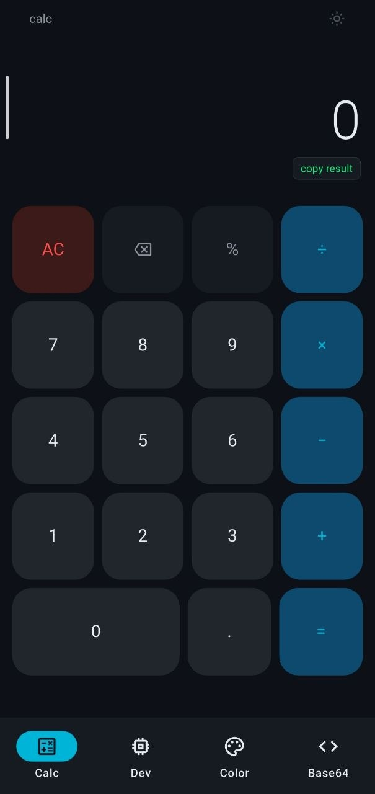
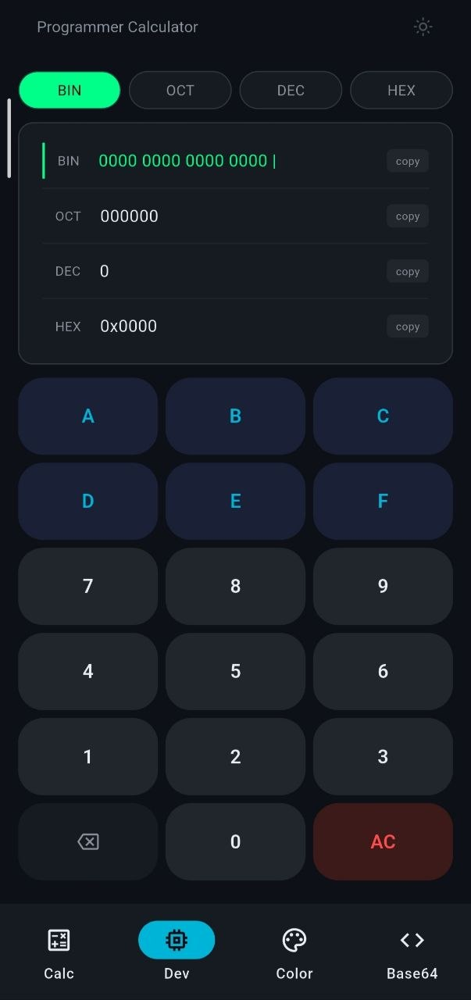
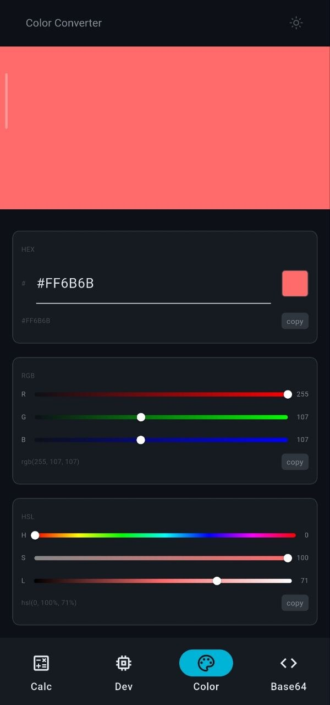
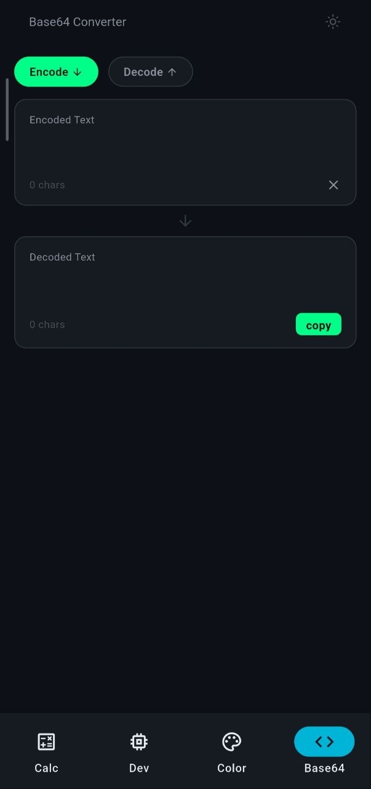

# DevCalc

A developer-focused calculator app. Offline, fast, and built with Flutter.

> Built as a Flutter learning project — documenting decisions and trade-offs openly.

---

## Screenshots

<p align="center">
  
  
  
  
</p>

A light theme is also available — toggle from the icon in the top right of any screen.

---

## Features

- **Standard calculator** — expression parsing, basic arithmetic, copy result to clipboard
- **Programmer calculator** — live conversion between binary, octal, decimal, and hex with a 16-bit view
- **Color converter** — HEX / RGB / HSL with a live preview swatch and per-format copy buttons
- **Base64 encoder/decoder** — text ↔ Base64 with UTF-8 support
- **Light & dark themes** — switchable from any screen

---

## Tech stack

| Layer              | Choice                                                              |
| ------------------ | ------------------------------------------------------------------- |
| State management   | [`flutter_bloc`](https://pub.dev/packages/flutter_bloc) (Cubit)     |
| Immutable state    | [`freezed`](https://pub.dev/packages/freezed)                       |
| Navigation         | [`go_router`](https://pub.dev/packages/go_router) with `ShellRoute` |
| DI                 | [`get_it`](https://pub.dev/packages/get_it)                         |
| Expression parsing | [`math_expressions`](https://pub.dev/packages/math_expressions)     |
| Responsive sizing  | [`flutter_screenutil`](https://pub.dev/packages/flutter_screenutil) |

No backend. No analytics. No accounts. The app runs entirely offline.

---

## Architecture

The project follows a **feature-first** layout. Each feature owns its own `domain/`, and `presentation/` layers, so a feature can be removed or extracted with minimal cross-cutting cleanup.

```
lib/
├── app/           # theme, router, DI setup
├── core/          # cross-feature services, utils, shared widgets
├── features/
│   ├── standard_calculator/
│   ├── programmer_calculator/
│   ├── color_converter/
│   └── base64/
│       ├── domain/        # models, services, enums
│       └── presentation/  # cubit, pages, widgets
└── shared/        # cross-feature models & services
```

### Key decisions

- **Cubit instead of Bloc.** The state changes in this app are simple — no streams of events to manage. Cubit is lighter and easier to read, with the same safety guarantees.
- **Sealed result classes** for errors that I expect (`CalculationResult`, `Base64Result`). The cubit has to handle both success and failure cases — the compiler won't let me forget.
- **One place for all theme colors** (`AppColors.primary`, `AppColors.opBackground`, etc.) using a custom `ThemeExtension`. Switching between light and dark animates smoothly because of this.
- **Services behind an interface** (e.g. `ClipboardService` with `FlutterClipboardService` as the real implementation). This way the cubit doesn't depend on Flutter directly, which makes it easier to test.

---

## Running it

```bash
flutter pub get
dart run build_runner build --delete-conflicting-outputs
flutter run
```

Requires Flutter SDK with Dart `>=3.8.1 <4.0.0`. Tested on Android and iOS.

---

## License

MIT — see [`LICENSE`](LICENSE).
